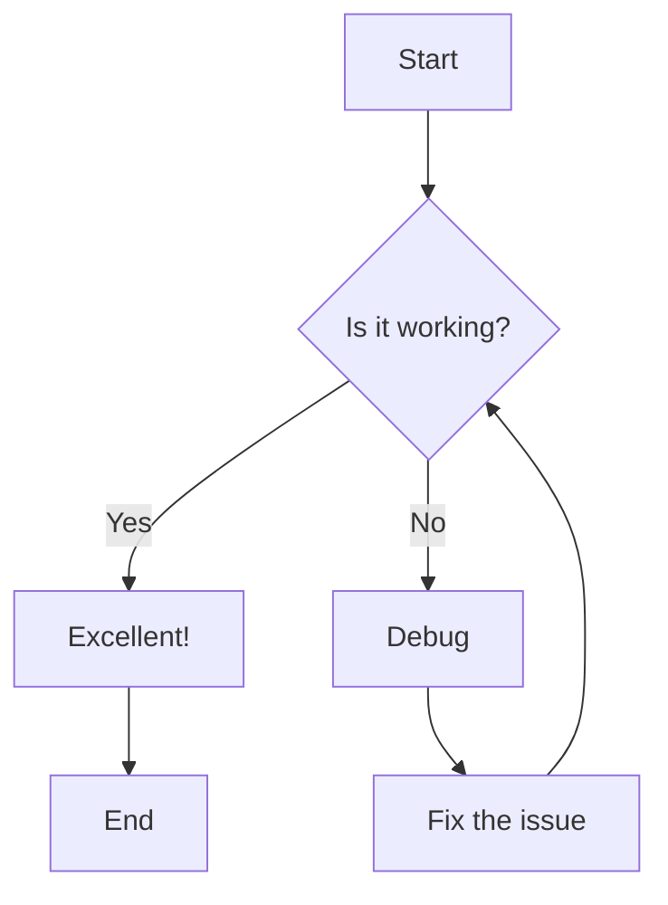
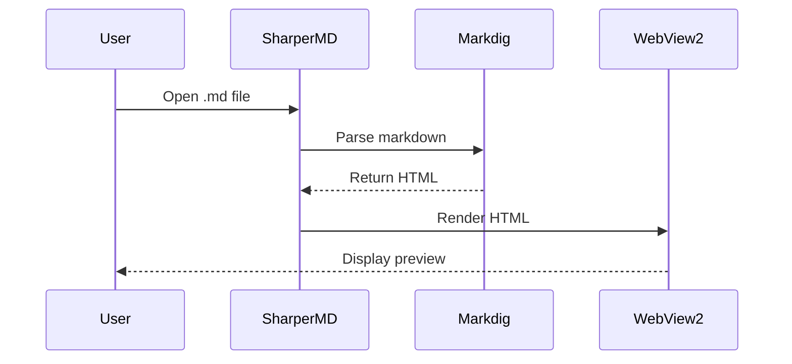
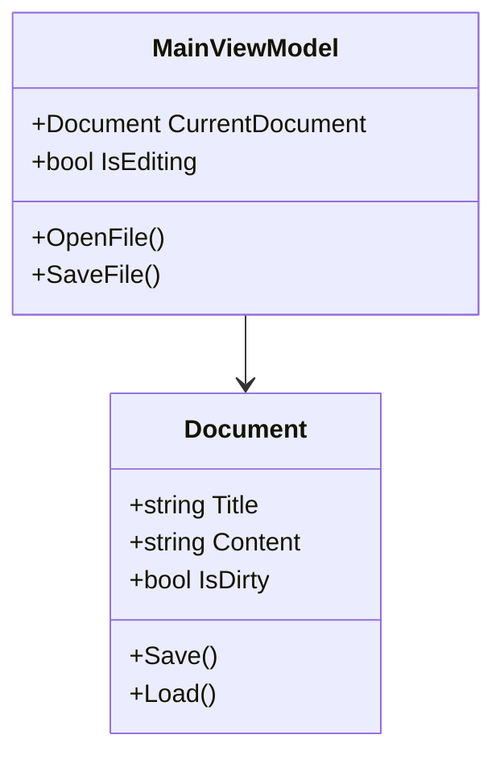
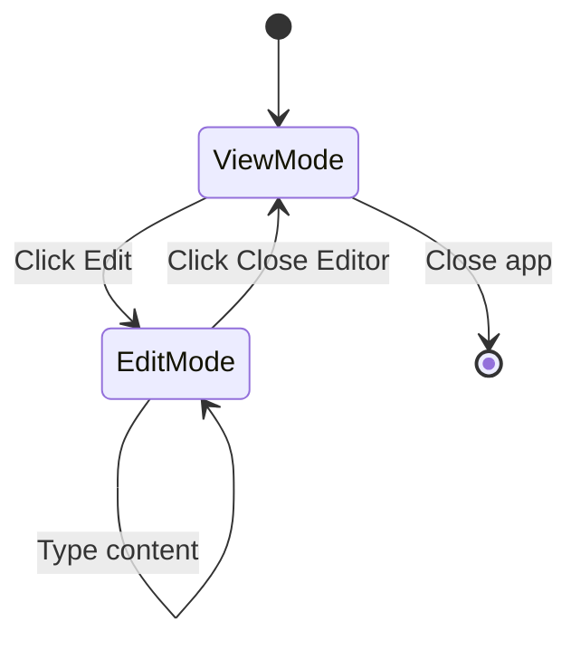
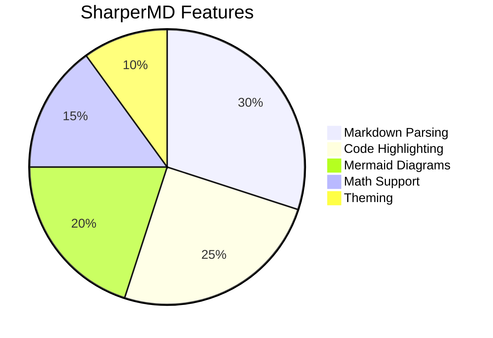
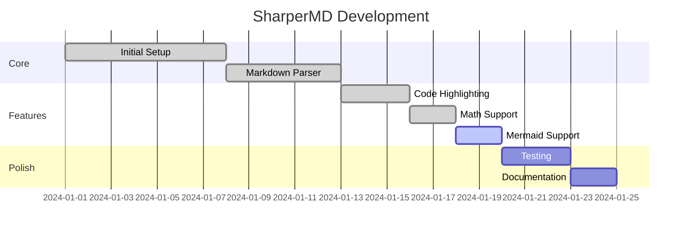

# SharperMD Test Document

This document tests all markdown features supported by SharperMD.

---

## Headers

# Heading 1
## Heading 2
### Heading 3
#### Heading 4
##### Heading 5
###### Heading 6

---

## Text Formatting

**Bold text** and __also bold__

*Italic text* and _also italic_

***Bold and italic*** and ___also both___

~~Strikethrough text~~

This is `inline code` within a sentence.

---

## Links

[Regular link](https://github.com)

[Link with title](https://github.com "GitHub Homepage")

Auto-linked URL: https://www.microsoft.com

Email: example@email.com

---

## Images


Scaled with HTML:


---

## Blockquotes

> This is a blockquote.
> It can span multiple lines.

> Nested blockquotes:
>> Level 2
>>> Level 3

---

## Lists

### Unordered List
- Item 1
- Item 2
  - Nested item 2.1
  - Nested item 2.2
    - Deep nested item
- Item 3

### Ordered List
1. First item
2. Second item
   1. Nested item 2.1
   2. Nested item 2.2
3. Third item

### Task List
- [x] Completed task
- [x] Another completed task
- [ ] Incomplete task
- [ ] Another incomplete task

### Definition List
Term 1
:   Definition for term 1

Term 2
:   Definition for term 2
:   Another definition for term 2

---

## Code Blocks

### C#
```csharp
public class HelloWorld
{
    public static void Main(string[] args)
    {
        Console.WriteLine("Hello, SharperMD!");
    }
}
```

### SQL
```sql
SELECT u.Name, COUNT(o.Id) AS OrderCount
FROM Users u
LEFT JOIN Orders o ON u.Id = o.UserId
WHERE u.IsActive = 1
GROUP BY u.Name
HAVING COUNT(o.Id) > 5
ORDER BY OrderCount DESC;
```

### PowerShell
```powershell
Get-ChildItem -Path C:\Projects -Recurse |
    Where-Object { $_.Extension -eq ".md" } |
    ForEach-Object {
        Write-Host "Found: $($_.FullName)"
    }
```

### JSON
```json
{
    "name": "SharperMD",
    "version": "1.0.0",
    "features": ["markdown", "mermaid", "math"],
    "settings": {
        "theme": "dark",
        "fontSize": 14
    }
}
```

### YAML
```yaml
application:
  name: SharperMD
  version: 1.0.0
  features:
    - markdown
    - mermaid
    - math
  settings:
    theme: dark
    fontSize: 14
```

### Bash
```bash
#!/bin/bash
for file in *.md; do
    echo "Processing: $file"
    wc -w "$file"
done
```

### XML
```xml
<configuration>
    <appSettings>
        <add key="Theme" value="Dark" />
        <add key="FontSize" value="14" />
    </appSettings>
</configuration>
```

---

## Tables

### Simple Table
| Name | Age | City |
|------|-----|------|
| Alice | 28 | London |
| Bob | 34 | Paris |
| Carol | 25 | Tokyo |

### Aligned Table
| Left Aligned | Center Aligned | Right Aligned |
|:-------------|:--------------:|--------------:|
| Left | Center | Right |
| Data | Data | Data |
| More | More | More |

---

## Horizontal Rules

Three or more dashes:

---

Three or more asterisks:

***

Three or more underscores:

___

---

## Mathematics (LaTeX)

### Inline Math
The quadratic formula is $x = \frac{-b \pm \sqrt{b^2-4ac}}{2a}$ for solving $ax^2 + bx + c = 0$.

### Block Math
$$
\int_{-\infty}^{\infty} e^{-x^2} dx = \sqrt{\pi}
$$

$$
\sum_{n=1}^{\infty} \frac{1}{n^2} = \frac{\pi^2}{6}
$$

### Matrix
$$
\begin{bmatrix}
a & b \\
c & d
\end{bmatrix}
\times
\begin{bmatrix}
e & f \\
g & h
\end{bmatrix}
=
\begin{bmatrix}
ae+bg & af+bh \\
ce+dg & cf+dh
\end{bmatrix}
$$

---

## Mermaid Diagrams

### Flowchart


### Sequence Diagram


### Class Diagram


### State Diagram


### Pie Chart


### Gantt Chart


---

## Footnotes

Here is a sentence with a footnote[^1].

Another statement that needs a reference[^2].

[^1]: This is the first footnote.
[^2]: This is the second footnote with more detail.

---

## Abbreviations

The HTML specification is maintained by the W3C.

*[HTML]: Hyper Text Markup Language
*[W3C]: World Wide Web Consortium

---

## Emojis

:smile: :heart: :thumbsup: :rocket: :star:

---

## Escaping Characters

\*Not italic\*

\`Not code\`

\# Not a heading

---

## HTML (if supported)

<details>
<summary>Click to expand</summary>

This content is hidden by default.

- Hidden item 1
- Hidden item 2

</details>

---

## Edge Cases

### Long code line
```
This is a very long line of code that should scroll horizontally rather than wrap: const result = someFunctionWithAVeryLongName(parameterOne, parameterTwo, parameterThree, parameterFour, parameterFive);
```

### Empty code block
```
```

### Special characters in code
```csharp
var specialChars = "<>&\"'©®™";
var path = @"C:\Users\Test\Documents";
```

### Nested formatting
***~~Bold italic strikethrough~~***

### Table with code
| Function | Description |
|----------|-------------|
| `Save()` | Saves the document |
| `Load()` | Loads a document |

---

## Summary

If all sections above render correctly, SharperMD is working as expected!

- [x] Headers
- [x] Text formatting
- [x] Links
- [x] Blockquotes
- [x] Lists (all types)
- [x] Code blocks (all languages)
- [x] Tables
- [x] Math (LaTeX)
- [x] Mermaid diagrams
- [x] Footnotes
- [x] Emojis
- [x] Special characters
